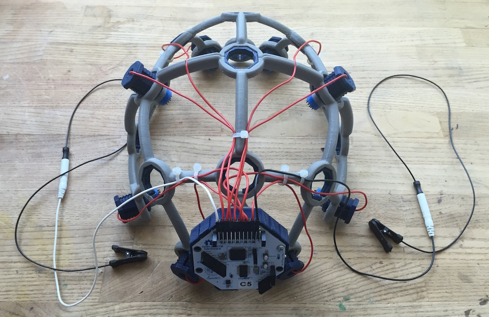

# Ultracortex

The Ultracortex is an open-source, 3D-printable headset intended to work with the [OpenBCI system](http://openbci.com/). It is capable of recording research-grade brain activity (EEG), muscle activity (EMG), and heart activity (ECG). 

Designers & Engineers:

* [Aaron Trocola (aka Threeform)](http://threeformfashion.com/)
* [Conor Russomanno](https://twitter.com/russomanno15)
* [Joel Murphy (aka SafeForRobots)](https://twitter.com/safeforrobots)
* [Aaron Lehr](http://aaronlehr.com/portfolio/)

